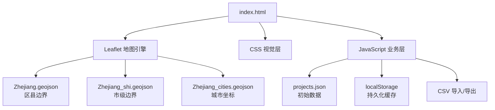

# 浙建降碳节能经营作战图

## 项目简介

"浙建降碳节能经营作战图"是一个基于 Web 的浙江省项目经营数据可视化平台。系统以浙江省行政地图为载体，结合科技感视觉风格，直观展示全省范围内降碳节能类项目的分布情况与经营状态，支持项目数据的增删改查、筛选、导入导出等完整台账管理功能。

## 功能特性

### 1. 地图可视化

- **浙江省全境地图展示**：基于 Leaflet.js 渲染浙江省行政区划地图，支持区县级边界精细展示
- **科技感视觉风格**：深蓝色渐变背景、网格扫描线、边框光效、角落辉光动画等视觉元素
- **多层级标注切换**：缩放级别 < 9 时显示市级项目标记，缩放级别 ≥ 9 时切换为区县级项目标记
- **项目状态颜色编码**：黄色（合作对接）、蓝色（意向签订）、绿色（正式合约）

### 2. 顶部统计面板

- 实时统计展示项目总数、合作对接数、意向签订数、正式合约数
- 卡片式布局，带发光动画效果

### 3. 项目维护台账

- **身份验证保护**：点击图例面板需输入访问密码，输入框默认掩码显示，支持眼睛切换查看
- **项目 CRUD**：支持新增、编辑、删除项目记录
- **多维度筛选**：按市、区县、项目状态组合筛选
- **分页浏览**：支持每页 5/10/20 条数据切换
- **CSV 导入导出**：支持 UTF-8 和 GBK 编码的 CSV 文件导入，带 BOM 头检测自动适配

### 4. 自动轮播提示

- 鼠标/键盘无操作 10 秒后，自动轮播各项目标记的 Tooltip 信息
- 任意交互操作后停止轮播，重新计时

### 5. 数据持久化

- 项目数据默认从 `projects.json` 加载
- 首次加载后写入 `localStorage`，后续访问优先读取本地缓存
- 增删改操作实时同步到 `localStorage`

## 技术方案

### 技术栈

| 类别 | 技术选型 |
|------|----------|
| 地图渲染 | Leaflet.js 1.9.4 |
| 前端框架 | 原生 JavaScript（无框架依赖） |
| 本地服务 | Python http.server |
| 数据存储 | Netlify Blobs（生产）/ localStorage（开发/降级） |
| 服务端函数 | Netlify Functions |
| 地理数据 | GeoJSON（浙江省区县/市级边界） |

### 项目结构

```
DiTanZ/
├── index.html                  # 主页面（包含所有 HTML/CSS/JS）
├── projects.json               # 初始项目数据
├── Zhejiang.geojson            # 浙江省区县级 GeoJSON 边界数据
├── Zhejiang_shi.geojson        # 浙江省市级 GeoJSON 边界数据
├── Zhejiang_cities.geojson     # 浙江省城市坐标 GeoJSON 数据
├── Qingdan.csv / Qingdan_utf8.csv / Qingdan.xlsx  # 项目清单源数据
├── analyze_geojson.py          # GeoJSON 数据分析脚本
├── analyze_shi.py              # 市级数据分析脚本
├── logo.png                    # Logo 图片
├── image/
│   └── logo.png               # Logo 图片副本
├── .netlify/
│   └── functions/
│       └── api.js             # Netlify Functions API 处理函数
├── netlify.toml               # Netlify 部署配置文件
├── 启动项目.bat                # Windows 一键启动脚本
└── README.md                   # 项目文档
```

### 架构设计



## 关键技术要点

### 1. 多层级标记切换机制

系统根据地图缩放级别动态切换标记展示粒度：

- **市级视图（zoom < 9）**：展示市级标记，带项目数量徽章和统计 Tooltip
- **区县级视图（zoom ≥ 9）**：展示区县级项目标记，隐藏市级标记

实现方式：通过 `map.on('zoomend')` 监听缩放事件，动态控制标记的 `opacity` 和图层添加/移除。

```javascript
// 核心逻辑：根据缩放级别控制标记可见性
districtProjectMarkers.forEach(function(marker) {
    marker.setOpacity(currentZoom >= 9 ? 1 : 0);
});
cityMarkers.forEach(function(marker) {
    if (currentZoom >= 9) {
        map.removeLayer(marker);
    } else {
        map.addLayer(marker);
    }
});
```

### 2. 自动轮播提示系统

用户无操作 10 秒后启动自动轮播，每 4 秒切换一个标记的 Tooltip：

```javascript
// 监听多种交互事件重置计时器
document.addEventListener('mousemove', resetInactivityTimer);
map.on('move', resetInactivityTimer);
// 10秒无操作后启动轮播
inactivityTimeout = setTimeout(startAutoRotation, 10000);
```

### 3. CSV 多编码兼容

CSV 导入时自动检测文件编码，同时支持 UTF-8 和 GBK：

```javascript
// 先用 UTF-8 解码，若出现乱码标记则回退 GBK
if (content.includes('\uFFFD')) {
    var gbkDecoder = new TextDecoder('GBK');
    content = gbkDecoder.decode(buffer);
}
```

### 4. 区县坐标映射

系统中预设了浙江省 11 个地级市下辖所有区县的经纬度坐标映射表（`getDistrictCenter` 函数），用于在区县级视图下精确定位项目标记。坐标数据涵盖杭州、宁波、温州等共 11 个市的约 90 个区县。

### 5. 科技感视觉效果

通过纯 CSS 实现了一系列科技风视觉特效：

- **网格背景**：通过 `background-image` 的 `linear-gradient` 重复生成 60px 网格
- **辉光脉冲**：`@keyframes glowPulse` 控制底部辉光呼吸效果
- **边框光效**：四角装饰线 + `inset box-shadow` 营造发光边框
- **扫描线**：`repeating-linear-gradient` 模拟 CRT 扫描线效果
- **状态卡片**：`::before` 伪元素 + 渐变动画实现呼吸光条

### 6. 数据持久化策略

```
初始化流程:
  localStorage 有数据? 
    ├── 是 → 直接使用缓存数据 → 渲染
    └── 否 → fetch(projects.json) → 写入 localStorage → 渲染

数据变更时:
  修改 projectsData → saveProjects() → 写入 localStorage → 刷新地图标记 + 统计面板
```

## 快速开始

### 环境要求

- Python 3.x（用于启动本地 HTTP 服务）

### 启动方式

**方式一：一键启动（Windows）**
双击运行 `启动项目.bat`

**方式二：命令行启动**
```bash
cd 项目目录
python -m http.server 8080
```
浏览器访问：http://localhost:8080

### 使用说明

1. 打开页面后，可缩放浏览浙江省地图
2. 点击右下角图例面板 → 输入访问密码 → 进入项目台账管理
3. 在地图上悬停城市/区县标记查看项目统计详情
4. 通过台账页面进行项目的增删改查、导入导出操作

## 浏览器兼容性

- Chrome（推荐）
- Edge
- Firefox
- Safari

需支持 ES6 语法和 `TextDecoder` API。

## Netlify 部署

### 部署流程

1. **创建 GitHub 仓库**：将项目代码推送到 GitHub 仓库
2. **登录 Netlify**：访问 [Netlify](https://www.netlify.com/) 并登录
3. **连接仓库**：点击 "Add new site" → "Import an existing project" → 选择 GitHub 仓库
4. **部署站点**：Netlify 会自动检测 `netlify.toml` 并完成部署

**注意**：Netlify Blobs 是**零配置**的，不需要手动启用或配置任何环境变量。Netlify 会自动处理存储配置。

### 数据持久化策略（生产环境）

```
初始化流程:
  尝试访问 Netlify Blobs (/api/projects)
    ├── 成功 → 使用 Netlify Blobs 数据 → 设置 useNetlifyBlobs = true
    └── 失败 → 降级到 localStorage → 设置 useNetlifyBlobs = false
                   ├── localStorage 有数据?
                   │   ├── 是 → 使用缓存数据
                   │   └── 否 → 加载 projects.json → 写入 localStorage

数据变更时:
  修改 projectsData → saveProjects()
    ├── 写入 localStorage（始终）
    └── 如果 useNetlifyBlobs = true → 同步到 Netlify Blobs
```

### API 端点

| 端点 | 方法 | 描述 |
|------|------|------|
| `/api/projects` | GET | 获取项目数据 |
| `/api/projects` | POST | 保存项目数据 |
| `/api/projects` | DELETE | 删除项目数据 |

### 本地开发

本地开发时，由于无法访问 Netlify Functions 和 Blobs，系统会自动降级到 localStorage 存储：

```bash
cd 项目目录
python -m http.server 8080
```

访问 http://localhost:8080 即可进行本地开发测试。
